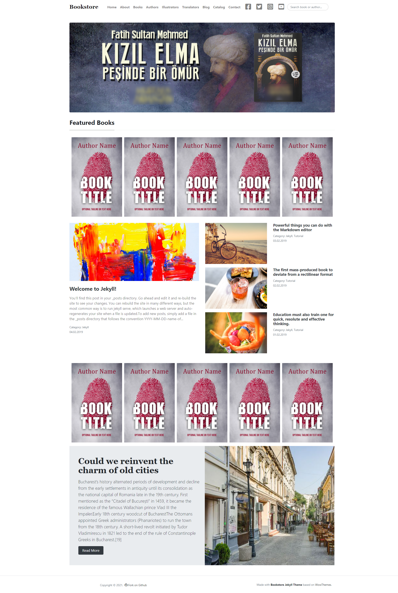

# Bookstore Jekyll Theme
### Live Demo

[Live Demo](https://bahadirdogru.github.io/bookstore-theme-jekyll/)



  

### Documentation

  A Jekyll template built with Bootstrap 4 suitable for bloggers. Highly inspired by Medium's website layout.
  And based on Mundata Theme.

  ### Install Bookstore

-   [Download](https://github.com/edamla/bookstore-theme-jekyll/archive/master.zip)  or  `git clone https://github.com/edamla/bookstore-theme-jekyll.git`
-   In Bookstore’s newly created directory  `bundle`
-   Change your configuration in  `_config.yml`. If your site is in root, for  `baseurl`, make sure this is set to  `baseurl: ''`
-   `jekyll serve --watch`

### Use

**YAML Post Example**:

```md
---
layout: post
title: "Tarih Şuuru Nasıl Verilir?"
authors: ["nurettin-taskesen"]
categories: [ "Yazılar", "Haberler" ]
image: assets/images/posts/tarih-suuru-nasil-verilmeli.jpg
tags: ["tarih", "şuur"]
sticky: true
featured: true
comments: false
# For adding excerpt add <!--more--> and break the line
---
Tarihle öldürebilirsiniz bir halkı, tarihle diriltebilirsiniz. Tarihi anlatma şekliniz, nasıl bir vatandaş istediğinizi, halka nasıl bir kimlik aşılamak için çırpındığınızı gösterir.
Türkiye fizikî olarak sömürgeleştirilmedi ama bir kısım aydınının kafası maalesef sömürgeleştirildi. Bu yüzden okullarında âdeta bir sömürge tarihi okutuldu.
<!--more-->
Kendi geçmiş ve medeniyetinden utanan, hatta ecdadına hınç duyan, zihnini Batı’ya kiralamış, bir yeniçeri sürüsü Türkiye’de bu aydınlar. Tarih de bu geçmişi silmenin en emin yolu oldu. “Osmanlı Anadolu’ya çivi çakmamıştı.” veya “Tarihimizde buluş yapan bilim adamı çıkmamış.” tarzındaki ucuz hükümler bu ihanetin sefil birer tecellisi.
```
`comments: false`  - disable comments in posts

`image: "https://www.myexternal.com/image.jpg"`  - set external featured image

`authors: ["author-1","author-2"]`  - to bind author collection

`featured: true`  - to display Featured posts on homepage

`sticky: true`  - to display sticky posts on homepage

**YAML Book Example**:
```md
---
layout: book
title: "Abdülhamid’in Kurtlarla Dansı 1"
authors: ["mustafa-armagan"]
illustrators: #["nur-dombayci","umit-ozturk"]
translators: #["naci-turan","burak-dogru"]
image: assets/images/ean/9786057410733.jpg
categories: [ "Tarih", "Osmanlı" ]
tags: [ "Osmanlı Tarihi", "Sultan Abdülhamid"]
previewpage: true

# Book attributes
ean: 9786057410733
languages: ["Türkçe"]
page: 384
size: "13,5x21cm"
publish-number: 2
cover: "Karton Kapak"
youtube: "https://www.youtube.com/watch?v=-_byyIDFln4"

# Buyout Ecommerce
dnr: "https://www.dr.com.tr/kitap/abdulhamidin-kurtlarla-dansi-1/mustafa-armagan/arastirma-tarih/tarih/osmanli-tarihi/urunno=0001938799001"
kitapyurdu: #"https://www.kitapyurdu.com"
idefix: #"https://www.idefix.com"
hepsiburada: #"https://www.hepsiburada.com"
odatvkitap: #"https://www.odatvkitap.com.tr"
bkmkitap: #"https://www.bkmkitap.com.tr"
amazontr: #"https://www.amazon.com.tr"
dkitap: #"https://www.dkitap.com.tr"
damlayayinevi: "https://www.damlayayinevi.com.tr/abdulhamid-in-kurtlarla-dansi-1"

# For adding excerpt add <!--more--> and break the line
---
Osmanlı tarihini yeniden yazmaya koyulan Mustafa Armağan’ın titiz ve akıcı kaleminden Son Sultan’ın Kurtlarla Dansı... Kitabı okuyunca dansın bugün de devam ettiğini fark edeceksiniz...
<!--more-->
Sultan 2. Abdülhamid 33 yıl boyunca etrafı “kurtlar”la çevrili bir ülkeyi sağ salim sahile çıkarmanın mücadelesini verdi. Hasta Adam’ın mirasının paylaşılması konusu 1850’lerde gündeme gelmişti.
```
`comments: false`  - disable comments in posts

`image: "https://www.myexternal.com/image.jpg"`  - set external featured image

`authors: ["author-1","author-2"]`  - to bind author collection

`translators: ["translator-1","translator-2"]`  - to bind translators collection

`illustrators: ["illustrator-1","illustrator-2"]`  - to bind illustrators collection

`featured: true`  - to display Featured books on homepage

`previewpage: true`  - to display preview page for books (check demo for details)

` Book attributes`  - This section for book attributes like ISBN number (ean). Size, cover etc.

` Buyout Ecommerce`  - This section for buying books online. Which ecommerce service can be found the book. Like Amazon.

There are Collections in this theme:
 - Pages
 - Posts
 - Books
 - Authors
 - Illustrators
 - Translators
 - Persons
 And written post can be found on /blog page.

**Slider**

Slider data in _data folder as a slider.json

I use json format.

For creating slider i use [tinyslider](https://github.com/ganlanyuan/tiny-slider) library.

```json
{
    "slides": [
        {
        "img": "assets/images/slides/1.jpg",
        "mobile-img": "assets/images/slides/1m.jpg",
        "alt": "slide1",
        "href": "https://www.youtube.com/watch?v=CuIoo1iGOts",
        "target": "_blank"
        }, {
        "img": "assets/images/slides/2.jpg",
        "mobile-img": "assets/images/slides/2m.jpg",
        "alt": "slide2",
        "href": "/kitaplar/abdulhamidin-kurtlarla-dansi-1",
        "target": ""
        }, {
        "img": "assets/images/slides/3.jpg",
        "mobile-img": "assets/images/slides/3m.jpg",
        "alt": "slide3",
        "href": "/kitaplar/kir-zincilerini-osmanli",
        "target": ""
        },{
        "img": "assets/images/slides/4.jpg",
        "mobile-img": "assets/images/slides/4m.jpg",
        "alt": "slide4",
        "href": "/kitaplar/kizil-elma-pesinde-bir-omur-fatih-sultan-mehmed",
        "target": ""
        },{
        "img": "assets/images/slides/5.jpg",
        "mobile-img": "assets/images/slides/5m.jpg",
        "alt": "slide5",
        "href": "/kitaplar/kuller-altinda-yakin-tarih-1",
        "target": ""
        },{
        "img": "assets/images/slides/6.jpg",
        "mobile-img": "assets/images/slides/6m.jpg",
        "alt": "slide6",
        "href": "/kitaplar/ezan-sehidi-menderes",
        "target": ""
        }
    ]

}
```
`img`  - This is image element source.

`mobile-img`  - This is image for mobile designed.

`alt`  - alt attribute of "img" html element.

`href`  - if slide has a link we use href.

`target`  - this is target attribute of "a" html element


### Contribute to Bookstore repository
  
1. In the top-right corner of this page, click **Fork**.

2. Clone a copy of your fork on your local, replacing *YOUR-USERNAME* with your Github username.
  
`git clone https://github.com/YOUR-USERNAME/bookstore-theme-jekyll.git`

 3.  **Create a branch**:

`git checkout -b <my-new-feature-or-fix>`

4.  **Make necessary changes and commit those changes**:
 
`git add .`

`git commit -m "new feature or fix"`

5.  **Push changes**, replacing `<add-your-branch-name>` with the name of the branch you created earlier at step #3. :

`git push origin <add-your-branch-name>`

6. Submit your changes for review. Go to your repository on GitHub, you'll see a **Compare & pull request** button. Click on that button. Now submit the pull request.

That's it! Soon I'll be merging your changes into the master branch of this project. You will get a notification email once the changes have been merged. Thank you for your contribution.

### This theme based on Mundana by WowThemes.net. You can check Mundana:

[Live Demo](https://wowthemesnet.github.io/mundana-theme-jekyll/) &nbsp; | &nbsp;
[Download](https://github.com/wowthemesnet/mundana-theme-jekyll/archive/master.zip) &nbsp; | &nbsp;
[Buy a coffe](https://www.wowthemes.net/donate/) &nbsp; | &nbsp;  [Documentation](https://bootstrapstarter.com/mundana-theme-jekyll/) &nbsp; | &nbsp;
[WordPress version](https://www.wowthemes.net/themes/mundana-wordpress/)

  

### Copyright
 
Mundana Theme designed and developed by [Sal](https://www.wowthemes.net), *free* under MIT license.

Bookstore Theme designed based on Mundana and developed by [Bahadır](https://www.bahadirdogru.com), *free* under MIT license.
  
You can buy a coffee to Mundana's developer and designer.

<a  href="https://www.wowthemes.net/donate/"  target="_blank"></a>

### Live Demo

[Live Demo](https://bahadirdogru.github.io/bookstore-theme-jekyll/)

### TO-DO List:
- [ ] snipcart feature (maybe)
- [ ] as a api service create all collections json files.
- [x] creating all kind of partner of book as a collection.

